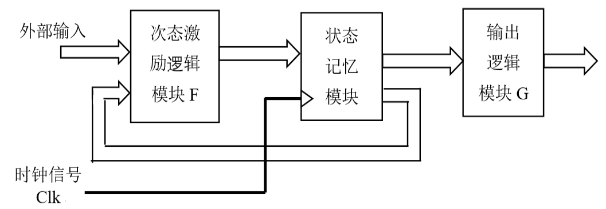
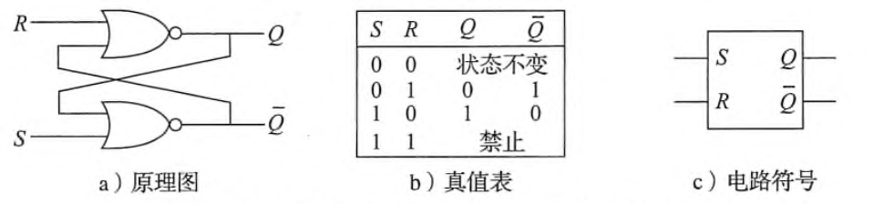
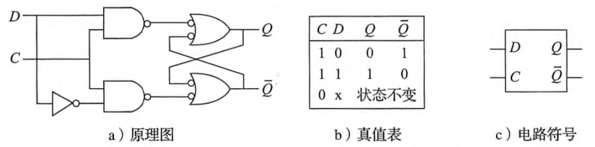
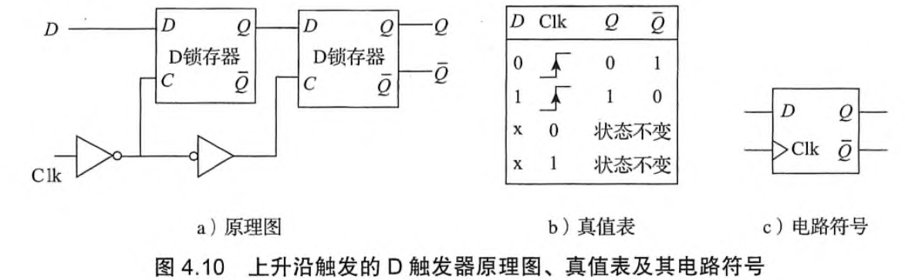
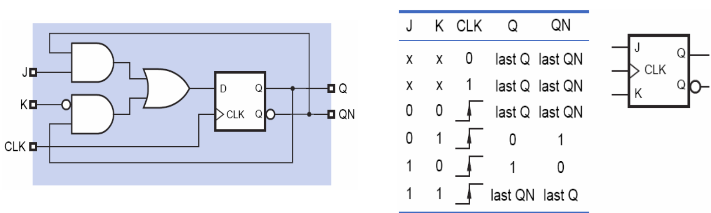
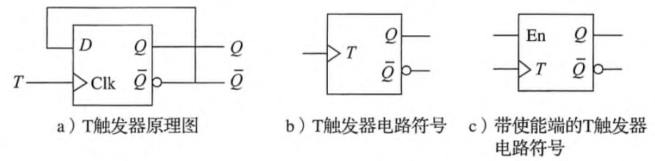
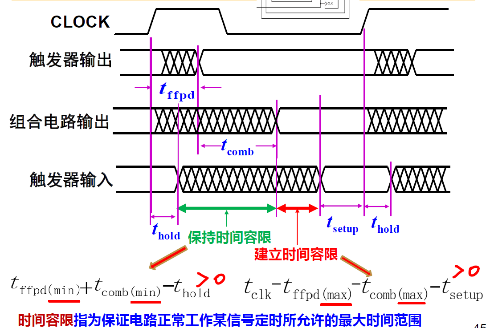
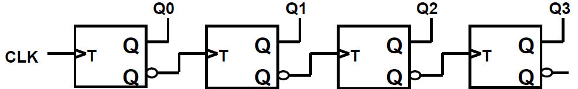
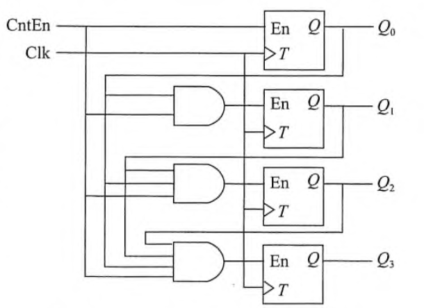

# 数字系统设计基础

---

- 计算机应由**运算器**、**控制器**、**存储器**、**输入设备**和**输出设备**五个基本部件组成。
  - **存储器**存放指令和数据
  - **控制器**负责取出指令来执行
  - **运算器**执行基本算术或逻辑运算等
  - **输入设备**、**输出设备**负责和外界进行信息交互。

 

- 内部以二进制表示指令和数据。
- 采用**存储程序**工作方式。

  

- **冯诺依曼结构计算机工作流程：**
  - **输入设备**将用户信息转换为二进制信号存入**存储器**
  - **控制器**从**存储器**中取出指令并译码
  - **运算器**对**存储器**中的数据进行基本算术或逻辑运算，处理后的结果暂存于**存储器**
  - 最后由**输出设备**转换为人类可识别的形式（如文字、图像等）

  

- **程序和指令的执行过程：**
  - **根据PC取指令**
  - **指令译码**
  - **计算操作数地址**
  - **取操作数**
  - **指令执行，运算**
  - **回写结果**
  - **修改PC的值**

  

- **字长**指定点运算数据通路的宽度，字长等于CPU内部定点运算部件的位数、通用寄存器的宽度等。
- **字**表示被处理信息的单位，用来度量数据类型的宽度。
- 字和字长的宽度可以一样，也可不同。

  

- LSB表示最低有效位，MSB表示最高有效位
- **大端方式**: MSB所在的地址是数据的地址
- **小端方式**: LSB所在的地址是数据的地址

  

- **一致律**：在组合电路用来消除时序冒险。
  - $X \cdot Y + \overline{X} \cdot Z + Y \cdot Z = X \cdot Y + \overline{X} \cdot Z$
  - $(X + Y) \cdot (\overline{X} + Z) \cdot (Y + Z) = (X + Y) \cdot (\overline{X} + Z)$
- **香农定理**
  - $F(X_1, X_2, \cdots, X_n) = X_1 \cdot F(1, X_2, \ldots, X_n) + \overline{X_1} \cdot F(0, X_2, \ldots, X_n)$
  - $F(X_1, X_2, \cdots, X_n) = \left[ X_1 + F(0, X_2, \ldots, X_n) \right] \cdot \left[ \overline{X_1} + F(1, X_2, \ldots, X_n) \right]$

  

- **标准乘积项**（**最小项**）：每个逻辑变量出现且仅出现一次的乘积项。
- **标准求和项**（**最大项**）：每个逻辑变量出现且仅出现一次的求和项。

 

- 标准和/最小项列表：使得函数输出为1的最小项之和。
- 标准积/最大项列表：使得函数输出为0的最大项之积。

 

- 最小项列表和最大项列表等价且可相互转换，**求补**即可。
- $f(A, B, C) = \sum m\,(0, 1, 2, 3) = \prod M\,(4, 5, 6, 7)$
  

- 代数法化简
  - 优点：不受变量数目的限制；化简比较直观
  - 缺点：没有一定的规律和步骤，技巧性很强；难以判断化简结果是否最简

 

- **卡诺图化简**
  - 编号按照**格雷码**的顺序排列，即相邻编号只有1位不同
  - **蕴涵项**：一个乘积项
  - **质蕴涵项**：没有被该逻辑函数的其它蕴涵项所覆盖的蕴涵项。
  - **实质蕴涵项**：覆盖的最小项中至少有一个最小项没有被其他质蕴涵项所覆盖的质蕴涵项。
  - 寻找该函数的**最小覆盖**。

  

- **组合逻辑电路**：输出值仅取决于于当前输入值
- **时序逻辑电路**：输出值不仅依赖于当前输入值，还与电路当前状态（现态）有关。

  

- 优先级顺序如下：**非** > **与和与非** > **异或和同或** > **或和或非**

  

- **无关项**
  - 某些输入组合对应的输出值可以任意值
  - 某些输入组合不应该出现在真值表中
  - 这些输入组合对应的输出值在化简时可标识为d，可以取值0或1，具体数值根据化简的需要而定
  - 可简化电路从而降低成本，但也更易受干扰

 

- **非法值**
  - 信号值不能被有效识别为高电平或低电平，处于不确定状态

 

- **三态门**是一种重要的总线接口电路，其输出既可以是通常的逻辑值1或0，又可以是高阻态。可用于连接总线，多个三态输出连在一起等
- **高阻态**：输出处于非正常逻辑态的第三种电气态，好像和电路断开一样

  

- **译码器**：
  - $n-2^n$ 译码器，输入端数比输出端数少
- **编码器**：
  - $2^n-n$ 编码器，译码器的逆向电路

 

- **多路选择器**：MUX
- **多路分配器**：DMUX

 

- **半加器（HA）**：仅考虑加数和被加数，不考虑低位来的进位
- **全加器（FA）**：输入为加数、被加数和低位进位Cin，输出为和F、进位Cout

  

- **下降沿延迟** $t_{pHL}$ ：输入变化引起相应**输出从高到低**变化的时间
- **上升沿延迟** $t_{pLH}$ ：输入变化引起相应**输出从低到高**变化的时间

 

- **传输延迟** $T_{pd}$ ：从输入端的变化开始到所有输出端得到最终稳定的信号所需的最长时间
- **最小延迟** $T_{cd}$ ：从输入端的变化开始到任何一个输出开始发生改变所需的最短时间

 

- **关键路径**：一个组合逻辑电路在输入和输出之间经过的最长路径
- **最短路径**

  

- **竞争冒险**：出现毛刺的电路
- **毛刺**：在输入信号变化的瞬间，输出端可能会出现不正确的尖峰信号
- 如何消除？：**低通滤波**或**增加冗余项**

  

- **状态记忆模块**：由多个状态记忆单元构成
- **次态激励逻辑模块F**：**激励函数**（现态和外部输入的逻辑函数）
- **输出逻辑模块G**：**输出函数**（现态和外部输入的逻辑函数）
  - **Mealy型**：输出依赖于当前状态和当前输入信号
  - **Moore型**：输出仅依赖于当前状态，和当前输入信号无关
- **同步时序逻辑电路**：在统一的时钟信号控制下进行状态转换

 

- **电平触发**
  - **锁存器**：通过激励输入的**电平**信号来控制存储元件的状态
- **边沿触发**：
  - **触发器**：具有时钟控制信号(clock)，通过时钟信号的**边沿**来触发存储元件改变状态
  - **上升沿触发**
  - **下降沿触发**

 

- **SR锁存器**
  - $Q^* = S + \overline{R} \cdot Q \quad (S \cdot R \neq 1)$

 

- **D锁存器**
  - $Q^* = D \quad (C = 1)$

 

- **D触发器**
  - $Q^* = D$
  - **建立时间$t_{setup}$**：输入信号D在时钟边沿到达前需稳定的时间
  - **保持时间$t_{hold}$**：输入信号D在时钟边沿到达后需继续稳定的时间

 

- **JK触发器**
  - $Q^* = J \cdot \overline{Q} + \overline{K} \cdot Q$

 

- **T触发器**
  - $Q^* = \overline{Q}$

  

- **需求分析**
- **状态图/表**
- **状态化简**：合并等价状态
- **状态编码**：每个状态赋予一个二进制编码
- **电路设计**：根据编码得到次态函数、激励函数和输出函数
- **电路分析**：能否自启动，是否进入挂起

 

- **挂起**：电路加电后进入未用状态，且在未用状态之间形成循环转换而无法进入工作状态。
- **自启动**：对未用状态进行分析，以判定电路进入未用状态时能否在有限个时钟周期后进入到工作状态。若能，且没有错误输出，则称电路为具有“自启动”能力。

  

- **触发器激励输入建立时间** $t_{setup}$
- **触发器激励输入保持时间** $t_{hold}$
- **组合电路传播延迟** $t_{comb}$
- **触发器传播延迟** $t_{ffpd}$
- **周期性时钟信号** $t_{clk}$

 

- 为使触发器正常工作，必须保证时钟周期 $t_{clk}$ 不能小于触发器锁存延迟 $t_{ffpd}$ + 次态信号经过激励逻辑延迟 $t_{comb}$ + 触发器的建立时间 $t_{setup}$
- 为使触发器正常工作，必须保证外部激励信号在时钟有效边沿到来后的保持时间 $t_{hold}$ 内能保持稳定不变。这就要求次态信号不能反馈太快，即触发器锁存延迟 $t_{ffpd}$ + 次态信号经过激励逻辑延迟 $t_{comb}$ 不能小于触发器的保持时间 $t_{hold}$

  

- **异步行波加法计数器**
  - $Q_{i+1}$ 总是在 $Q_i$ 由1变0时开始改变状态
  - 当编码为1111时，下个时钟到达后，经过 $n \cdot t_{TQ}$ 延时，又回到编码0000

 

- **同步并行加法计数器**
  - 当编码为1111时，只要经过一个与门 + $t_{TQ}$ 延时，就可回到编码0000，比行波（串行）加法计数器快得多！

 

- **寄存器/寄存器堆**

  

- **可编程逻辑器件(PLD)**
  - 主要由**与阵列**和**或阵列**构成
  - **可编程只读存储器（PROM）** 是一种**与阵列固定**、**或阵列可编程**的简单PLD。
  - **可编程阵列逻辑（PAL）** 是一种**与阵列可编程**、**或阵列固定**的逻辑阵列。
  - **可编程逻辑阵列（PLA）** 是一种**与阵列、或阵列都可编程**的逻辑阵列。
  - **通用阵列逻辑（GAL）**

 

- **存储器阵列**
  - 寄存器用来存储少量数据，速度更快；存储器阵列用来存储大量数据，速度较寄存器慢
  - **ROM（只读存储器）**：属于非易失性存储器，即使电源断电，ROM 中存储的数据也不会消失。
  - **RAM（随机存取存储器）**：属于易失性存储器， 一旦电源断电，RAM 中存储的数据就消失。
  - SRAM（静态存储器）：只要保持电源，存储单元中存放数据就保持不变
  - DRAM（动态存储器）

  

- **串行进位加法器**
  - $Cout = A \cdot B + A \cdot Cin + B \cdot Cin$
  - $Sum = A \oplus B \oplus Cin$

 

- **并行进位加法器（CLA加法器）**
  - **定义辅助函数**：
    - 进位生成函数 $G_i = A_iB_i \cdots$
    - 进位传递函数 $P_i = A_i + B_i \cdots$
  - **全加逻辑方程**：
    - $S_i = A_i \oplus B_i \oplus C_{i-1}$
    - $C_i = G_i + P_i \cdot C_{i-1}$ （4位CLU部件）

 

- 局部（单级）先行进位加法器
  - 组内并行、组间串行
- 多级先行进位加法器（CLA*加法器）
  - 组内并行、组间并行
  - BCLU部件

  

- **n位带标志加法器**
  - 溢出标志 $OF = C_n \oplus C_{n-1}$
  - 符号标志 $SF = F_{n-1}$
  - 零标志 $ZF = 1$ 当且仅当 $F = 0$
  - 进位/借位标志 $CF = Cout \oplus Cin$

  

- **整数减法**
  - **带符号数**减法溢出
    - 最高位和次高位的进位不同
    - 和的符号位和加数的符号位不同
  - **无符号数**减法溢出
    - 差为负数，即借位CF=1

- **A-B比较大小**
  - Unsigned: CF=0且ZF=0 时，A>B
  - Signed: OF=SF且ZF=0时，A>B

 

- **原码加减**
- 比较两数符号，**对加法实行“同号求和，异号求差”，对减法实行“异号求和，同号求差”。**
  - 求和：数值位相加，和的符号取被加数（被减数）的符号。若最高位产生进位，则结果溢出。
  - 求差：被加数（被减数）加上加数（减数）的补码。
    - a. 最高数值位产生进位表明加法结果为正，所得数值位正确。
    - b. 最高数值位没产生进位表明加法结果为负，得到的是数值位的补码形式，需对结果求补，还原为绝对值形式的数值位。
  - 差的符号位：a情况下，符号位取被加数（被减数）的符号；b情况下，符号位为被加数（被减数）的符号取反。

 

- **移码的和、差等于和、差的补码！**

 

- **原码乘法**
  - **原码一位乘法**
  - **原码两位乘法**
- **补码乘法**
  - **Booth算法**
  - **补码一位乘法**
  - **补码两位乘法**

 

- 无符号整数相乘：若乘积的高n位为非0，则溢出。
- 带符号整数相乘：若乘积高n位的每一位都相同，且都等于乘积低n位的符号，则不溢出，否则溢出。

  

- 一条指令中必须明显或隐含地包含以下信息：
  - **操作码**
  - **源操作数或其地址**
  - **结果的地址**
  - **下条指令地址**

 

- 设计指令格式时应遵循以下几条基本原则：
  - **指令应尽量短**
  - **要有足够的操作码位数**
  - **操作码的编码必须有唯一的解释**
  - **指令长度应是字节的整数倍**
  - **合理地选择地址字段的个数**
  - **指令应尽量规整**

  

- **寻址方式**：指令给出操作数或操作数地址的方式。
  - **立即寻址**
  - **直接寻址**
  - **间接寻址**
  - **寄存器直接寻址**
  - **寄存器间接寻址**
  - **偏移寻址**
    - **相对寻址**
    - **基址寻址**
    - **变址寻址**
  - **栈寻址**

  

- **条件测试方式**
  - OF
  - SF
  - ZF
  - CF

  

- **RISC设计风格的主要特点**：
  - **指令数目少**
  - **指令格式规整**
  - **指令周期短**
  - **采用Load/Store型指令设计风格**
  - **采用大量通用寄存器**
  - **采用组合逻辑电路控制**
  - **采用优化的编译系统**

  

- **异常是处理器在执行某条指令时在CPU内部发生的意外事件或特殊事件。**
- **中断是一种典型的由I/O设备触发的、与当前正在执行的指令无关的异步事件。**
- **在CPU外部发生的特殊事件，通过“中断请求”信号向CPU请求处理。**

 

- **异常**是在CPU内部发生的
- **中断**是由外部事件引起的

  

- **中央处理器（CPU）**
  - **数据通路是由操作元件和存储元件通过总线方式或分散方式连接而成的进行数据存储、处理、传送的路径。**
    - 由两类元件组成：
      - 组合逻辑元件（也称操作元件）
      - 时序逻辑元件（也称状态元件，存储元件）
    - 元件间的连接方式：
      - 总线连接方式
      - 分散连接方式
    - 由“操作元件”和“存储元件”通过总线方式或分散方式连接而成
    - 进行数据存储、处理、传送
  - **控制器**
    - **对指令进行译码，生成指令对应的控制信号，控制数据通路的动作。**
    - 能对执行部件发出控制信号，因此是指令的控制部件。

  

- **数据通路与时序控制**
  - 同步系统
    - 所有动作有专门时序信号来定时
    - 由时序信号规定何时发出什么动作
  - 时序信号：同步系统中用于进行同步控制的定时信号，如时钟信号
  - 指令周期：取并执行一条指令的时间

  

- 计算机性能与CPU时间
  - **CPU时间**：CPU真正花在程序执行上的时间，包括两部分：
    - 用户CPU时间：用来运行用户代码的时间
    - 系统CPU时间：为了执行用户程序而需要运行操作系统程序的时间
  - **时钟周期 / 频率**
  - **CPI**：执行一条指令所需的时钟周期数。（确定值 or 平均值）
    - CPI = (CPU时间 x 时钟频率) / 指令条数 = 总时钟周期数 / 指令条数
    - 单靠CPI不能反映CPU性能！
  - 用户CPU时间 = 程序总时钟周期数 x 时钟周期

  

- R-型指令
  - **add** rd, rs1, rs2
  - **slt** rd, rs1, rs2
  - **sltu** rd, rs1, rs2
- I-型指令
  - **ori** rd, rs1, imm12
  - **lw** rd, rs1, imm12
- S-型指令
  - **sw** rs1, rs2, imm12
- B-型指令
  - **beq** rs1, rs2, imm12
- U-型指令
  - **lui** rd, imm20
- J-型指令
  - **jal** rd, imm20

  

- **立即数拼接器**：根据指令格式对指令中的立即数进行拼接和扩展，形成32位立即数。
- **下地址逻辑**
- **算术逻辑部件的设计**

  

- 多周期处理器
  - 解决思路：
    - 把指令的执行分成多个阶段，每个阶段在一个时钟周期内完成。
    - 每步都设置状态单元，每步的执行结果都在下个时钟开始保存到相应单元。
  - 好处：
    - **时钟周期短**
    - **不同指令所用周期数可以不同**
    - **允许功能部件在一条指令执行过程中被重复使用**
